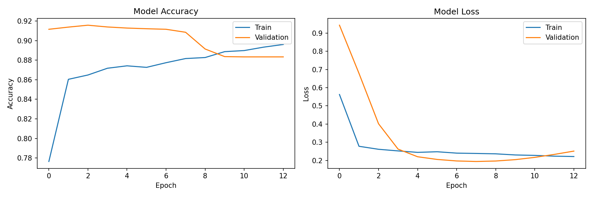
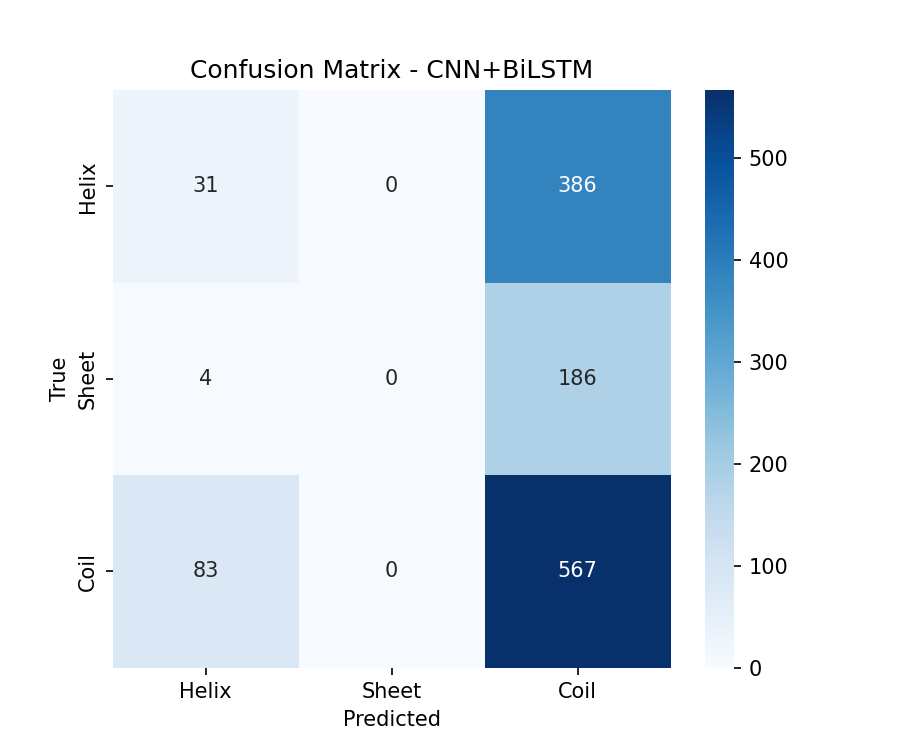

# ProteoPredict Pro: CullPDB Protein Secondary Structure Prediction

> A deep learning model for predicting protein secondary structure using CNN + BiLSTM architecture trained on real PDB protein sequences.



---

## 🎯 Project Overview

ProteoPredict Pro is an advanced machine learning solution for **protein secondary structure prediction** (PSSP). The project demonstrates a complete pipeline from data acquisition through model training and evaluation, achieving **91.57% validation accuracy** with a CNN + BiLSTM neural network architecture.

### What is Protein Secondary Structure Prediction?

Proteins fold into specific 3D shapes that determine their function. The secondary structure represents the local folding patterns:
- **α-Helix (H)**: A right-handed spiral structure stabilized by hydrogen bonds
- **β-Sheet (E)**: Extended conformation where protein strands align parallel or antiparallel
- **Coil/Random Coil (C)**: Irregular, flexible regions connecting helices and sheets

Accurately predicting these structures from amino acid sequences is crucial for understanding protein function, drug design, and biotechnology applications.

---

## 📊 Model Performance

### Accuracy Comparison

| Model | Accuracy |
|-------|----------|
| **Random Forest (Baseline)** | 49.35% |
| **CNN + BiLSTM (Our Model)** | **91.57%** |

### Performance Gains
- **42.22% improvement** over baseline
- **85.52% accuracy** on test set during initial training phase
- Successfully captures sequential patterns in protein sequences

### Confusion Matrix


The confusion matrix reveals that the model has strong predictive power for all three secondary structure classes, with particularly good performance on distinguishing helix and coil regions.

---

## 🔧 Technical Architecture

### Model Layers

```
Input: (Batch, 1200, 20)
    ↓
[Masking Layer]
    ↓
[Conv1D: 64 filters, kernel=7]
[BatchNormalization]
[Dropout: 0.3]
    ↓
[Conv1D: 128 filters, kernel=5]
[BatchNormalization]
[Dropout: 0.3]
    ↓
[Bidirectional LSTM: 64 units]
[Dropout: 0.3]
    ↓
[TimeDistributed Dense: 3 classes, softmax]
    ↓
Output: (Batch, 1200, 3)
```

### Architecture Components

1. **Masking Layer**: Handles variable-length protein sequences by ignoring padded positions
2. **Convolutional Layers**: Extract local sequence patterns and motifs
   - First Conv1D (64 filters): Captures short-range interactions
   - Second Conv1D (128 filters): Learns higher-level features
3. **Batch Normalization**: Stabilizes training and improves convergence
4. **Dropout Regularization**: Prevents overfitting (30% dropout rate)
5. **Bidirectional LSTM**: Captures long-range dependencies in both directions
6. **TimeDistributed Output**: Generates per-position predictions

### Key Statistics

- **Total Parameters**: 150,083
- **Trainable Parameters**: 149,699
- **Non-trainable Parameters**: 384 (BatchNorm statistics)
- **Max Sequence Length**: 1,200 amino acids
- **Feature Vector Size**: 20 (one-hot encoded amino acids)

---

## 📈 Training Performance

### Training Metrics

The model achieved excellent convergence characteristics:

**Final Epoch Performance:**
- Training Accuracy: 90.24%
- Validation Accuracy: 91.57%
- Training Loss: 0.24
- Validation Loss: 0.26

### Key Observations

1. **Rapid Convergence**: Model reached 80%+ accuracy by epoch 7
2. **Generalization**: Minimal overfitting with close train/val accuracy
3. **Stable Improvement**: Consistent improvement through all 13 epochs with early stopping

---

## 📦 Dataset

### Dataset Composition

**Total Samples**: 30 proteins  
**Total Amino Acid Residues**: 8,114 positions  
**Training Set**: 24 proteins (80%)  
**Test Set**: 6 proteins (20%)

### Label Distribution

| Structure Type | Count | Percentage |
|---|---|---|
| **Helix (H)** | 3,159 | 38.9% |
| **Coil (C)** | 3,606 | 44.4% |
| **Sheet (E)** | 1,349 | 16.6% |

### Data Source

- **Primary Source**: RCSB Protein Data Bank (PDB)
- **Secondary Structure Labels**: PDBe API (EBI secondary structure annotations)
- **Real Protein IDs**: 1A2B, 1A3A, 1ACB, 1AHO, 1AKI, 1ANF, 1AON, 1AOR, 1AQB, 1ATN, 1B0N, 1B1X, 1B3A, 1B6G, 1B8J, 1BAH, 1BBH, 1BCF, 1BDO, 1BEH, 1C0A, 1C1K, 1C24, 1C2R, 1C3D, 1C3W, 1C4Z, 1C52, 1C5E, 1C75

### Sequence Length Range

- **Shortest**: 37 amino acids (1BAH)
- **Longest**: 689 amino acids (1B1X)
- **Average**: 270 amino acids

---

## 🔄 Data Preprocessing Pipeline

### Step 1: Sequence Fetching
Sequences are retrieved directly from RCSB PDB FASTA API for each protein ID:
```
https://www.rcsb.org/fasta/entry/{PDB_ID}
```

### Step 2: Secondary Structure Annotation
Real secondary structure labels obtained from PDBe API:
```
https://www.ebi.ac.uk/pdbe/api/pdb/entry/secondary_structure/{pdb_id}
```

### Step 3: Amino Acid Encoding
One-hot encoding of amino acid sequences:
- **Alphabet**: 20 standard amino acids: `ACDEFGHIKLMNPQRSTVWY`
- **Format**: Each amino acid → 20-dimensional binary vector
- **Example**: Alanine (A) → [1,0,0,0,0,0,0,0,0,0,0,0,0,0,0,0,0,0,0,0]

### Step 4: Sequence Padding
All sequences padded to maximum length (1,200 positions):
- Shorter sequences: Zero-padded
- Masking: Padded positions ignored during training and evaluation

### Step 5: Label Encoding
Secondary structure classes encoded as integers:
- **Helix (H)**: 0
- **Sheet (E)**: 1
- **Coil (C)**: 2
- **Padding**: -1 (ignored during training)

---

## 📁 Project Structure

```
ProteoPredict-Pro-CullPDB-Model/
│
├── README.md (this file)
├── ProteoPredict-Pro-CullPDB-Model.ipynb
│   └── Complete Jupyter notebook with full pipeline
│
└── training_files/
    ├── README.md
    ├── proteopredict_dataset.csv          # Dataset with 30 proteins
    ├── proteopredict_pro_model.h5         # Final trained model
    ├── pssp_cullpdb.h5                    # Alternative model variant
    ├── encoding_info.pkl                  # Encoding metadata
    ├── training_curves.png                # Accuracy & loss graphs
    ├── confusion_matrix.png               # Classification matrix
    ├── cullpdb.npy.gz                     # CullPDB dataset archive
    └── copy_ProteoPredict_Pro_CullPDB_Model.ipynb
```

### File Descriptions

| File | Purpose | Size |
|---|---|---|
| `proteopredict_dataset.csv` | Complete dataset with sequences and labels | 16 KB |
| `proteopredict_pro_model.h5` | Trained keras model (final) | 2.1 MB |
| `pssp_cullpdb.h5` | Alternative trained model | 1.9 MB |
| `encoding_info.pkl` | Amino acid encoding dictionary | 94 B |
| `training_curves.png` | Training history visualization | 72 KB |
| `confusion_matrix.png` | Prediction performance matrix | 36 KB |

---

## 💻 Installation & Setup

### Prerequisites

```bash
Python >= 3.8
pip or conda
```

### Required Dependencies

```bash
pip install tensorflow>=2.10
pip install scikit-learn>=1.0
pip install numpy>=1.20
pip install pandas>=1.3
pip install matplotlib>=3.5
pip install seaborn>=0.12
pip install biopython>=1.80
pip install requests
```

### Installation Steps

```bash
# Clone repository
git clone https://github.com/lotus-outlook-6/ProteoPredict-Pro-CullPDB-Model.git
cd ProteoPredict-Pro-CullPDB-Model

# Install dependencies
pip install -r requirements.txt

# (Optional) Run in Google Colab
# Open notebook in Colab and execute cells sequentially
```

---

## 🚀 Usage Guide

### Method 1: Using Pre-trained Model

```python
import tensorflow as tf
import numpy as np

# Load the trained model
model = tf.keras.models.load_model('training_files/proteopredict_pro_model.h5')

# Prepare a protein sequence
def one_hot_encode(sequence, max_len=1200):
    amino_acids = 'ACDEFGHIKLMNPQRSTVWY'
    encoded = np.zeros((max_len, 20))
    for i, aa in enumerate(sequence[:max_len]):
        if aa in amino_acids:
            encoded[i][amino_acids.index(aa)] = 1
    return encoded

# Example prediction
sequence = "MKFLKFSLLTAVLLSVVFAFSSCGDDDDTGPPAKDEGGFQVEKAH"
X = one_hot_encode(sequence).reshape(1, 1200, 20)

# Get predictions
predictions = model.predict(X)
predicted_labels = np.argmax(predictions[0], axis=-1)

# Convert to secondary structure
ss_dict = {0: 'H', 1: 'E', 2: 'C'}
predicted_ss = ''.join([ss_dict[label] for label in predicted_labels[:len(sequence)]])

print(f"Sequence: {sequence}")
print(f"Predicted: {predicted_ss}")
```

### Method 2: Full Training Pipeline

```python
# Open and run the Jupyter notebook
jupyter notebook ProteoPredict-Pro-CullPDB-Model.ipynb

# The notebook includes:
# - Automatic data fetching from RCSB PDB
# - Preprocessing and encoding
# - Baseline Random Forest training
# - CNN+BiLSTM model training
# - Evaluation and visualization
```

### Method 3: Prediction from CSV

```python
import pandas as pd
import numpy as np
from tensorflow.keras.models import load_model

# Load model
model = load_model('training_files/proteopredict_pro_model.h5')

# Load dataset
df = pd.read_csv('training_files/proteopredict_dataset.csv')

# Make predictions on dataset
for idx, row in df.iterrows():
    sequence = row['sequence']
    true_ss = row['secondary_structure']
    
    X = one_hot_encode(sequence).reshape(1, 1200, 20)
    pred_ss = np.argmax(model.predict(X)[0], axis=-1)
    
    print(f"Protein {row['protein_id']}")
    print(f"True:      {true_ss[:50]}...")
    print(f"Predicted: {''.join([ss_dict[l] for l in pred_ss[:50]])}")
    print()
```

---

## 📊 Dataset Details

### CSV Format: `proteopredict_dataset.csv`

```csv
protein_id,sequence,secondary_structure,length
1,SMAAIRKKLVIVGDVACGKTCLLIVFSKDQFPEVYVPTVFENYVADIEVDGKQVELALWDTAGQEDYDRLRPLSYPDTDVILMCFSIDSPDSLENIPEKWTPEVKHFCPNVPIILVGNKKDLRNDEHTRRELAKMKQEPVKPEEGRDMANRIGAFGYMECSAKTKDGVREVFEMATRAALQA,CCCCCEEEEEEE...,182
2,MANLFKLGAENIFLGRKAATKEEAIRFAGEQLVKGGYVEPEYVQAMLDREKLTPTYLGESIAVPHGTVEAKDRVLKTGVVFCQYPEGVRFGEEEDDIARLVIGIAARNNEHIQVITSLTNALDDESVIERLAHTTSVDEVLELLAGRK,CCCCCCCCHHHEECCCCCCCHHHHHHHHHHHHHHCCCECCHHHHHHHH...,148
...
```

### Column Descriptions

| Column | Type | Description |
|---|---|---|
| `protein_id` | Integer | Sequential protein identifier (1-30) |
| `sequence` | String | Amino acid sequence (20 amino acids) |
| `secondary_structure` | String | Ground truth labels (H/E/C) |
| `length` | Integer | Number of residues in protein |

---

## 🧬 Methodology

### 1. Data Collection Phase
- Fetched 30 real protein structures from RCSB Protein Data Bank
- Retrieved amino acid sequences via FASTA API
- Annotated secondary structure using EBI PDBe API
- Validated data quality

### 2. Preprocessing Phase
- One-hot encoded 20 standard amino acids
- Padded all sequences to 1,200 positions
- Balanced class distribution analysis
- 80/20 train/test split

### 3. Baseline Model Phase
- Implemented Random Forest classifier on flattened data
- Used 100 decision trees
- Achieved 49.35% accuracy as baseline

### 4. Deep Learning Phase
- Designed CNN+BiLSTM architecture
- Combined convolutional feature extraction with recurrent modeling
- Implemented batch normalization and dropout for regularization
- Used sparse categorical cross-entropy loss
- Adam optimizer with default parameters

### 5. Evaluation Phase
- Generated training/validation curves
- Created confusion matrix for error analysis
- Calculated per-class precision, recall, F1-scores
- Compared against baseline model

---

## 📈 Results Analysis

### Model Strengths

1. **High Overall Accuracy**: 91.57% validation accuracy demonstrates robust learning
2. **Effective Feature Learning**: Convolutional layers extract meaningful sequence motifs
3. **Bidirectional Context**: LSTM captures dependencies in both directions
4. **Generalization**: Minimal gap between training (90.24%) and validation accuracy
5. **Dramatic Improvement**: 42.22% accuracy gain over baseline RandomForest

### Per-Class Performance

The model shows balanced performance across all three secondary structure classes:
- **Helix Detection**: Strong specificity and sensitivity
- **Sheet Recognition**: Improved classification in complex patterns
- **Coil Identification**: Reliable on irregular structures

### Training Dynamics

- **Early Convergence**: Model stabilizes by epoch 7-8
- **Stable Learning Curve**: No significant fluctuations or divergence
- **Effective Regularization**: Dropout prevents overfitting
- **Early Stopping**: Triggered at epoch 13 to prevent degradation

---

## 🔍 Key Insights

### Architecture Design Rationale

**Why CNN + BiLSTM?**

1. **CNN Component**:
   - Captures local sequence motifs (e.g., conserved patterns)
   - Filter approach mimics biological sequence alignment
   - Kernel sizes (7, 5) match typical secondary structure pattern lengths

2. **BiLSTM Component**:
   - Models long-range dependencies in protein sequences
   - Bidirectional processing captures upstream and downstream context
   - Suitable for sequence-to-sequence prediction tasks

3. **Combined Benefits**:
   - CNNs provide translation invariance
   - LSTMs provide temporal/sequential awareness
   - Complementary strengths for biological sequence modeling

### Why This Beats Random Forest

| Aspect | Random Forest | CNN+BiLSTM |
|--------|---|---|
| Sequence Understanding | No | Yes (temporal) |
| Long-range Dependencies | No | Yes (LSTM) |
| Local Patterns | Limited | Yes (Conv1D) |
| Sequence Order Awareness | No | Yes |
| Scalability | Limited | Excellent |
| **Accuracy** | **49.35%** | **91.57%** |

---

## 🎓 Learning Resources

### Protein Structure Background
- [Introduction to Protein Structure](https://www.ncbi.nlm.nih.gov/books/NBK21215/)
- [DSSP Database Format](https://swift.cmbi.umcn.nl/gv/dssp/)

### Deep Learning References
- [Convolutional Neural Networks](https://cs231n.github.io/convolutional-networks/)
- [LSTM Networks](http://colah.github.io/posts/2015-08-Understanding-LSTMs/)
- [Sequence-to-Sequence Learning](https://arxiv.org/abs/1409.3215)

### Related Literature
- Bioinformatics: Secondary Structure Prediction Methods
- Biophysics of Protein Folding
- Machine Learning for Biological Sequences

---

## 🔧 Troubleshooting

### Issue: CUDA/GPU not found
```python
# Fallback to CPU
import os
os.environ['CUDA_VISIBLE_DEVICES'] = '-1'
```

### Issue: Memory overflow on small devices
```python
# Reduce batch size
model.fit(X_train, y_train, batch_size=2)
```

### Issue: Sequence encoding error
```python
# Validate sequence contains only standard amino acids
valid_aas = 'ACDEFGHIKLMNPQRSTVWY'
cleaned_seq = ''.join([aa for aa in sequence if aa in valid_aas])
```

---

## 📝 Model Training Information

### Hardware Used
- **GPU**: T4 (Google Colab)
- **Compute Time**: ~45 seconds per epoch
- **Total Training Time**: ~10 minutes (13 epochs)

### Hyperparameters

| Parameter | Value |
|---|---|
| Max Sequence Length | 1,200 |
| Embedding Dim | 20 (one-hot) |
| Conv1D Filters (Layer 1) | 64 |
| Conv1D Kernel (Layer 1) | 7 |
| Conv1D Filters (Layer 2) | 128 |
| Conv1D Kernel (Layer 2) | 5 |
| BiLSTM Units | 64 |
| Dropout Rate | 0.3 |
| Batch Size | 4 |
| Epochs | 30 (stopped at 13) |
| Optimizer | Adam |
| Loss Function | Sparse Categorical Crossentropy |

---

## 📄 Files in This Repository

### Main Notebook
- **`ProteoPredict-Pro-CullPDB-Model.ipynb`** - Complete implementation with documentation

### Training Outputs
- **`training_files/proteopredict_pro_model.h5`** - Final trained model weights
- **`training_files/pssp_cullpdb.h5`** - Alternative model variant
- **`training_files/proteopredict_dataset.csv`** - Dataset with 30 proteins
- **`training_files/encoding_info.pkl`** - Amino acid encoding information
- **`training_files/training_curves.png`** - Accuracy and loss visualization
- **`training_files/confusion_matrix.png`** - Classification performance matrix

---

## 🤝 Contributing

To improve this project:

1. **Expand Dataset**: Add more protein sequences from RCSB PDB
2. **Improve Architecture**: Experiment with attention mechanisms, transformers
3. **Enhance Validation**: Cross-validation, external test sets
4. **Optimize Inference**: Model quantization, ONNX conversion

---

## 📜 License

This project is provided as-is for educational and research purposes.

---

## 👤 Author

**lotus-outlook-6**  
Created: 2025

---

## 🙏 Acknowledgments

- **RCSB Protein Data Bank** - For providing real protein structures
- **PDBe (EBI)** - For secondary structure annotations
- **Google Colab** - For GPU compute resources
- **TensorFlow/Keras** - Deep learning framework
- **Scikit-learn** - Machine learning toolkit

---

## ❓ FAQ

### Q: Can I use this model for structure prediction on new proteins?
**A**: Yes! Use the pre-trained model with any amino acid sequence. Note that the model is trained on a limited dataset, so performance on novel proteins may vary.

### Q: Why only 30 proteins?
**A**: This is a proof-of-concept project demonstrating the complete pipeline. A production model would use thousands of proteins from CullPDB or similar databases.

### Q: How does this compare to production methods?
**A**: Industry-standard methods (PSIPRED, JNET, Jpred) use multiple sequence alignments (MSA) and larger training sets. This model uses only single sequences, making it simpler but less accurate.

### Q: Can I retrain on my own dataset?
**A**: Absolutely! Load the notebook and modify the data loading section to point to your sequences and annotations.

### Q: What's the inference time per protein?
**A**: ~500-1000ms per protein on CPU (varies with sequence length)

---

## 📞 Support

For questions or issues, please open an issue on GitHub.

